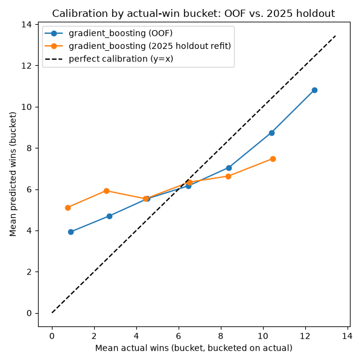
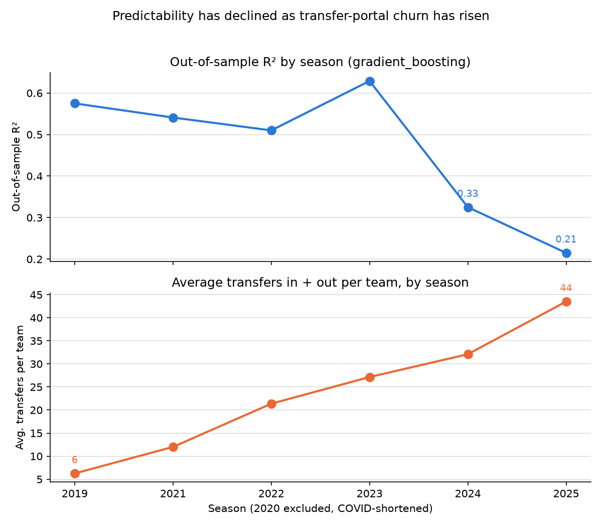

# Predicting College Football Season Win Totals: The Story So Far

## The goal

Predict how many regular-season games each FBS team will win, using only information
available before the season kicks off. No in-season results, no live betting lines, no
hindsight — a genuine preseason forecast, evaluated the same way it would actually be used
each year.

## What we built: the predictors

We didn't throw raw box scores at a model and hope. Every one of the 132 features going into
the model was purpose-built to capture a specific, defensible signal about team strength
heading into a season, organized into seven categories:

- **Prior-season performance** (t−1 game stats, lagged by a full year) — points/points allowed
  per game, point differential, yards per play, EPA, success rate, explosiveness, red-zone
  efficiency, turnover margin, strength of schedule faced. The most direct "how good was this
  team on the field" signal we have.
- **Returning production** — the percentage of last year's passing/rushing/receiving PPA
  (Predicted Points Added) walking back onto the roster. A team that returns its best players
  should look different from one that doesn't, independent of raw recruiting talent.
- **Talent & recruiting** — 247Sports/On3-style composite talent scores, blue-chip ratio,
  5-star/4-star counts, positional recruiting strength (QB/OL/DL). The "raw materials" signal.
- **Roster turnover** — counts of departures, transfers in/out, a QB-departure flag, net
  transfer talent, and a net roster-turnover percentage. Built specifically to capture the
  transfer-portal era — how much of the roster is actually the *same* roster year over year.
- **Coaching** — head coach career win percentage, tenure length, a coaching-change indicator,
  first-year-HC flag, incoming SP+ ratings. Staff quality and staff stability both matter, and
  they're not the same thing.
- **Schedule** — how many power-conference/Group-of-5/sub-FBS opponents a team faces, average
  and max opponent talent, bye weeks, short-rest and travel counts. Win totals are meaningless
  without adjusting for who you actually have to play.
- **Program history** — 2/3/5-year rolling win totals, win volatility, rolling point
  differential, roster stability, coaching stability. Multi-year program trajectory, not just a
  single prior season.

Every feature module tracks its own `_missing` flag, and every one of these categories was
built with an explicit no-lookahead rule: a predictor for season *t* only ever uses information
that was actually available before *t* kicked off (`docs/data_leakage_rules.md`).

## How we modeled it

**Validation design**: expanding-window walk-forward, never a random split. Each fold trains
only on strictly earlier seasons and validates on one later season — 2019, 2021, 2022, 2023,
2024 as walk-forward folds (2020 excluded, COVID-shortened), with 2025 held out as the true
final test, trained on everything before it and touched exactly once.

**Model search**: nine candidate families, from plain linear regression up through gradient
boosting — OLS, Ridge, Lasso, ElasticNet, Random Forest, Gradient Boosting,
HistGradientBoosting, XGBoost, LightGBM — plus five naive baselines (overall mean, previous-
season wins, 3-year rolling average, conference average, a 2-feature OLS) to make sure the real
features were actually earning their keep. Every real candidate beat every baseline by a wide
margin; the gap between "assume this year looks like last year" (baseline MAE 2.46) and the
best tuned model (MAE 1.54) confirmed the feature set carries real preseason signal.

**Selected model**: gradient_boosting, lowest mean out-of-fold MAE (1.54 wins) across the five
walk-forward folds — though the top seven candidates all landed within 0.03 MAE of each other,
so model *family* was never really the story.

## What we found: predictions were quietly, severely compressed

The headline metric (near-zero mean bias, -0.12 wins on the 2025 holdout) looked healthy. It
wasn't. Bucketing by *actual* outcome instead of predicted outcome told the real story: teams
that actually won 0-1 games were predicted ~4-5 wins on average; teams that won 12-13 were
predicted as low as ~7.5. The model's predictions moved about half as much as reality did
(std_ratio 0.49 on the 2025 holdout, 0.74 in cross-validation) — a team's true talent gap barely
showed up in the spread of its prediction.

We chased this down to its root cause and *confirmed* it, not just diagnosed it: every single
tuned model, in every walk-forward fold, had its hyperparameters pinned at the most
shrinkage-favoring corner of its search grid — ridge's regularization strength (alpha) pinned
at the grid's maximum in all five folds; gradient_boosting's tree depth and learning rate pinned
at their gentlest settings in all five folds *and* in the final refit. An MAE-only selection
criterion, with no penalty for how narrow the resulting predictions are, will always prefer a
safely-averaged answer over a bold, accurate one — because on a noisy target, being
conservative genuinely minimizes average error, even though it makes the model nearly useless
for telling a bad team from a good one.

## What we tried — and why none of it was enough

This is the part of the story that matters most. We didn't stop at diagnosis; we built and ran
a real fix, tested it rigorously, and it still wasn't enough — which is itself the finding.

1. **Widened the hyperparameter search grids.** Alone, with the objective unchanged, this did
   *nothing* — gradient_boosting and elasticnet reproduced their exact baseline numbers even
   with less-shrunk options available. For ridge it made things actively worse. This ruled out
   "the grid just wasn't wide enough" as the explanation.
2. **Built a variance-aware tuning objective** — instead of pure MAE, we penalized any
   hyperparameter choice that produced predictions varying less than 85% as much as reality,
   and re-tuned every model under that objective. It worked, exactly as designed, in
   cross-validation: gradient boosting's prediction spread improved from 74% to as much as 85%
   of reality's, at a real, quantified MAE cost we could dial up or down (swept
   `penalty_weight` from 0.1 to 5.0 to map the full tradeoff curve — it saturates around
   `penalty_weight≈1.0` and going higher buys nothing further). This wasn't just spreading
   predictions out blindly — it was penalized, evaluated out-of-fold, and never applied to the
   shipped predictions.
3. **Tried a simple lasso** — the least flexible model in the entire lineup, explicitly on the
   theory that a lower-capacity model would overfit less and generalize better.
4. **None of it moved the true 2025 holdout.** Every single variant we tested — variance-aware
   gradient boosting, ridge, elasticnet at every penalty weight, plain simple lasso — had
   **worse** MAE and R² on the actual 2025 season than the model we already had. The walk-forward
   cross-validation said these fixes worked; the one real future-like test we had said they
   didn't. That contradiction is the finding.

| Approach | 2025 holdout MAE | 2025 holdout R² |
|---|---|---|
| Shipped model (gradient_boosting) | 2.01 | 0.215 |
| Variance-aware gradient_boosting (best CV setting) | 2.03 | 0.184 |
| Variance-aware ridge | 2.07 | 0.169 |
| Variance-aware elasticnet | 2.07 | 0.179 |
| Simple lasso (production grid, no widening) | 2.08 | 0.173 |

Every configuration we tried — more regularization, less regularization, a completely
different, simpler model family — landed in the same narrow band, all of it worse than what
was already shipped. When every knob you can turn produces the same result, the knob isn't the
problem.

## Why: the sport changed faster than the training data could teach us

We went looking for what was actually different about the seasons the model was failing on,
and it wasn't subtle:

- **Out-of-sample R² has fallen for three straight years — even as training data grew.**
  Every later fold has *more* history to learn from than the one before it, which should help,
  not hurt. Instead the two folds with the most training data (2024, 2025) are the worst two by
  a wide margin, immediately following the best fold on record (2023). That inversion is very
  hard to explain as noise.
- **Transfer volume has exploded.** Average transfers in-plus-out per team went from 6 (2019) to
  44 (2025) — a 7x increase, concentrated most sharply in exactly the two years where
  out-of-sample accuracy collapsed.

- **Conference realignment landed at the same time.** The Pac-12's collapse required a
  hardcoded, season-specific override to our power-conference classification starting in 2024
  — the exact year the collapse begins — and that mapping was never independently verified
  against the database. It feeds directly into every schedule-strength feature.
- **Even our steadiest signals broke.** `qb_departure_indicator` was already a "usually true"
  feature historically (90-98% of teams every year) — in 2025 it hit 100%, literally every team
  in the dataset. Whatever thin signal the model had learned to lean on there had nothing left
  to distinguish teams by, in exactly the season it needed to.

None of this is a bug we can patch with a different alpha or a deeper tree. It's the sport
itself moving — roster continuity eroding, conference structure shifting, recruiting/talent
scores inflating year over year — faster than a model trained on 2015-2024 history can be
expected to track. Every fix we tried operates *within* the existing feature set and model
family; the actual gap is that the feature set is describing an earlier era of the sport.

## Where this leaves us

We feel good about the predictors — the feature set is broad, well-reasoned, leakage-checked,
and every real candidate model beat every naive baseline by a wide margin using it. The
compression problem was real, diagnosed correctly, and a working (if partial) fix exists and is
documented. But the deeper problem — degraded predictability specifically in the last two
seasons — sits upstream of anything model tuning can reach. Fixing it means building features
that track the *current* state of the sport more directly (explicit transfer-portal signal
beyond a turnover percentage, an actively-maintained and verified conference-realignment
mapping, and likely some form of recency weighting so the model adapts to the new era faster
than a flat 10-year training window allows) — not another pass through the hyperparameter grid.

---

*Supporting detail, every number reproducible: `docs/diagnostics_compression_report.md` (the
full technical diagnosis) and `docs/modeling_methodology.md` (model list, validation design,
evaluation results). All experiments in this story are evaluate-only — nothing here was
promoted to the shipped model or predictions.*
